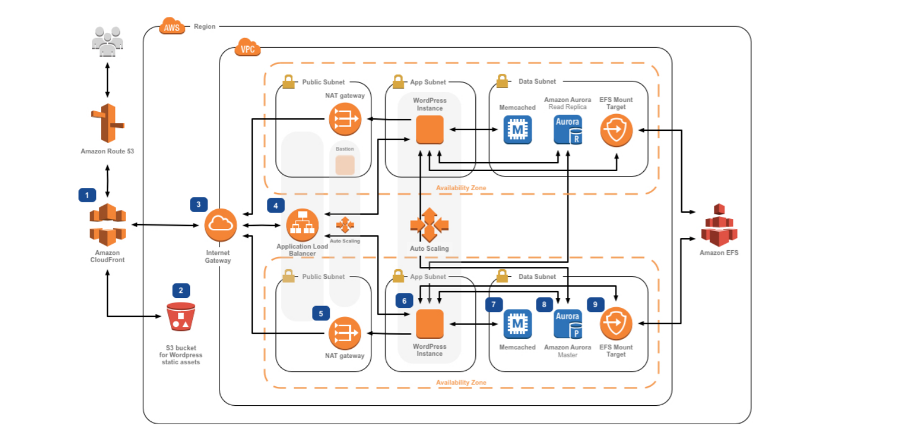

# Architecture 


# Tech stack

* Ansible 
* Terraform
* Packer
* Terragrunt

# Deploy the project 

* Run the simple `Makefile` command

```
make all
```

> This will produce the following tasks:
 * Create a custom AMI
 * Create remote state storage for terraform
 * Create master resources liek VPC, Subnet, Security groups, etc...

# Known Issues

* The first known issue shared content with EFS like this [issue](https://github.com/aws-samples/aws-refarch-wordpress/issues/68) on github. EFS is for high availability scalable content, EFS is not well suitable for hosting your website, a better solution is to use an S3 Bucket. However, you can get around with this issue by changing the idle timeout of the application loadbalancer and cloudfront configuration as well as using [unison](https://github.com/aws-samples/aws-refarch-wordpress/issues/68#issuecomment-1118835350) 

# Future work

* Design and implement CI/CD Pipeline 
* Better monitoring with cloudwatch
* Redesign Packer `HCL` config

